# Multi-Tier Web Application Demo 

Welcome to this sleek, containerized multi-tier web app that demonstrates modern development practices with Docker and Kubernetes. It's a simple yet powerful example of how to build scalable applications using microservices architecture.

## What's This All About?

Imagine a web app where users hit a frontend, which talks to a backend API, which in turn stores data in Redis. That's exactly what we've got here – a classic three-tier setup that's fully containerized and ready to rock in Kubernetes.

### Key Highlights
- **Frontend**: Nginx-powered web server serving a clean HTML interface
- **Backend**: Node.js Express server handling API requests and hit counting
- **Data Store**: Redis keeping track of those all-important visit numbers
- **Deployment**: Kubernetes manifests for production-grade scaling
- **Health Monitoring**: Built-in checks to keep everything running smoothly

## System Architecture

Here's the high-level view of how everything connects:

```mermaid
graph LR
    subgraph "Client"
        U[User<br/>Web Browser]
    end

    subgraph "Kubernetes Cluster"
        subgraph "Frontend Tier"
            FS[Frontend Service<br/>Type: LoadBalancer<br/>Port: 80]
            FD[Frontend Deployment<br/>Replicas: 1<br/>Nginx Container<br/>Port: 80]
        end

        subgraph "Backend Tier"
            BS[Backend Service<br/>Type: ClusterIP<br/>Port: 4001]
            BD[Backend Deployment<br/>Replicas: 2<br/>Node.js Express<br/>Port: 4001]
        end

        subgraph "Data Tier"
            RS[Redis Service<br/>Type: ClusterIP<br/>Port: 6379]
            RD[Redis Deployment<br/>Replicas: 1<br/>Redis Alpine<br/>Port: 6379]
        end
    end

    U -->|HTTP| FS
    FS --> FD
    FD -->|Proxy /api| BS
    BS --> BD
    BD -->|Redis Protocol| RS
    RS --> RD

    style U fill:#e3f2fd,stroke:#1976d2,stroke-width:2px
    style FS fill:#f3e5f5,stroke:#7b1fa2,stroke-width:2px
    style FD fill:#f3e5f5,stroke:#7b1fa2,stroke-width:2px
    style BS fill:#e8f5e8,stroke:#388e3c,stroke-width:2px
    style BD fill:#e8f5e8,stroke:#388e3c,stroke-width:2px
    style RS fill:#fff3e0,stroke:#f57c00,stroke-width:2px
    style RD fill:#fff3e0,stroke:#f57c00,stroke-width:2px
```



The flow is straightforward: User hits the frontend, which proxies API calls to the backend, which interacts with Redis for data.

## What You'll Need

Before diving in, make sure you have:
- Docker installed and running
- A Kubernetes cluster (local Minikube works great for testing)
- kubectl configured and pointing to your cluster

## Getting Started

Let's get this thing running! We'll deploy to Kubernetes since that's where the real magic happens.

### Step 1: Set Up the Namespace
```bash
kubectl apply -f Kube/namespace.yml
```

### Step 2: Deploy Redis
Redis is our data hero here.
```bash
kubectl apply -f Kube/redis-deploy.yml
kubectl apply -f Kube/redis-service.yml
```

### Step 3: Bring Up the Backend
The brains of the operation.
```bash
kubectl apply -f Kube/backend.yml
kubectl apply -f Kube/backend-service.yml
```

### Step 4: Launch the Frontend
The pretty face of our app.
```bash
kubectl apply -f Kube/frontend.yml
kubectl apply -f Kube/frontend-service.yml
```

### Step 5: Access Your App
Find the frontend service's external IP:
```bash
kubectl get svc -n multi-tier-deployment
```

Grab that IP and hit it in your browser. You should see the app with a hit counter that increments on each visit!

## API Reference

### GET /api
The main endpoint that returns app status and hit count.

**Example Response:**
```json
{
  "message": "hi",
  "hits": 1337,
  "time": "2023-10-01T12:34:56.789Z"
}
```

### GET /health
Quick health check to ensure backend and Redis are communicating.

**Success Response:** `OK`
**Error Response:** `Redis not reachable`

## Development & Customization

### Building Custom Images
Want to tweak the code? Build your own images:

```bash
# Backend
cd Backend
docker build -t your-registry/multi-tier-backend:latest .

# Frontend
cd Frontend
docker build -t your-registry/multi-tier-frontend:latest .
```

Don't forget to update the Kubernetes YAMLs with your new image tags!

### Configuration
The backend uses environment variables defined in `Backend/.env`:
- `REDIS_HOST`: IP of your Redis service
- `REDIS_PORT`: Usually 6379
- `PORT`: Backend listening port (4001)

